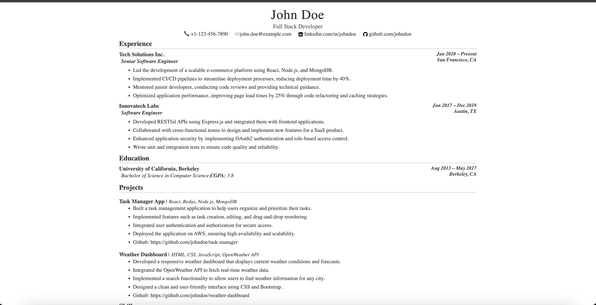
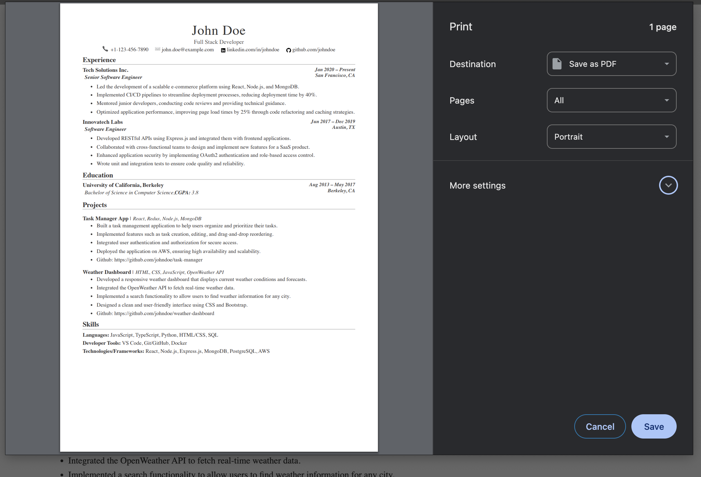

# Resume Template - React App

This project is a customizable resume template built with [Create React App](https://github.com/facebook/create-react-app). It allows you to generate a resume by filling in data in a configuration file.

## Features

- Fully customizable resume template.
- Easy-to-edit configuration file for adding your personal details, skills, experience, and more.
- Built with React for a modern and responsive design.
- Ready for deployment.

## Getting Started

This project was bootstrapped with [Create React App](https://github.com/facebook/create-react-app).

### Prerequisites

Make sure you have [Node.js](https://nodejs.org/) and `npm` installed on your system.

## Available Scripts

In the project directory, you can run:

### `npm start`

Runs the app in the development mode.\
Open [http://localhost:3000](http://localhost:3000) to view it in the browser.

The page will reload if you make edits.\
You will also see any lint errors in the console.

### `npm test`

Launches the test runner in the interactive watch mode.\
See the section about [running tests](https://facebook.github.io/create-react-app/docs/running-tests) for more information.

### `npm run build`

Builds the app for production to the `build` folder.\
It correctly bundles React in production mode and optimizes the build for the best performance.

The build is minified and the filenames include the hashes.\
Your app is ready to be deployed!

### `npm run eject`

**Note: this is a one-way operation. Once you `eject`, you can’t go back!**

If you aren’t satisfied with the build tool and configuration choices, you can `eject` at any time. This command will remove the single build dependency from your project.

Instead, it will copy all the configuration files and the transitive dependencies (webpack, Babel, ESLint, etc) right into your project so you have full control over them. All of the commands except `eject` will still work, but they will point to the copied scripts so you can tweak them. At this point you’re on your own.

## How to Use

1. Clone this repository to your local machine.
2. Open the `config` file (or the relevant file for data input) and fill in your personal details, skills, experience, and other information.
3. Run `npm start` to preview your resume in the browser.
4. Customize the template as needed to match your style.

## Screenshots

Here are some screenshots of the application:

### Resume Preview

## Learn More

You can learn more in the [Create React App documentation](https://facebook.github.io/create-react-app/docs/getting-started).

To learn React, check out the [React documentation](https://reactjs.org/).
